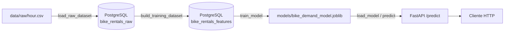

# Bike Demand MLOps

## Objetivo
O objetivo do projeto é fazer todo o processo de MLOps para o dataset de demandas por bicicleta, com o dataset disponível em https://archive.ics.uci.edu/dataset/275/bike+sharing+dataset.

## Arquitetura

O projeto segue uma arquitetura em camadas, separando ingestão, persistência, feature engineering, treinamento e disponibilização do modelo:



- **`src/config.py`**: carrega variáveis de ambiente do `.env` (credenciais do PostgreSQL).
- **`src/common`**: código compartilhado — conexão com o banco (`database.py`), definição das tabelas via SQLAlchemy `MetaData` (`schema.py`) e logging (`logger.py`).
- **`src/ingestion`**: leitura e validação do CSV bruto (`data/raw/hour.csv`) e carga na tabela `bike_rentals_raw`.
- **`src/features`**: leitura dos dados brutos do banco, criação de features de calendário e cíclicas (seno/cosseno de hora, dia da semana e mês) e persistência na tabela `bike_rentals_features`.
- **`src/training`**: split temporal (sem shuffle, evitando vazamento de dados), treino de um modelo baseline (`DummyRegressor`) e do modelo principal (`HistGradientBoostingRegressor`), avaliação (MAE, RMSE, R²) e persistência do modelo (`models/`) e das métricas (`reports/training_metrics.json`).
- **`src/prediction`**: carrega o modelo treinado e monta o dataframe de entrada com as mesmas features usadas no treino.
- **`src/api`**: API FastAPI que expõe os endpoints `/health` e `/predict`, carregando o modelo no `lifespan` da aplicação.
- **`src/dashboard`** e **`src/monitoring`**: pacotes reservados para o dashboard de visualização e monitoramento do modelo (ainda não implementados).
- **PostgreSQL**: banco relacional que armazena os dados brutos e as features, orquestrado via Docker Compose com healthcheck.
- **Docker**: a API é empacotada em um `Dockerfile` próprio (imagem `python:3.12-slim` + `uv`) e orquestrada junto do PostgreSQL pelo `compose.yaml`.

## Pipeline de dados e modelo

1. **Ingestão** (`src.ingestion.load_raw_dataset`): lê `data/raw/hour.csv`, valida colunas esperadas e duplicidade de `instant`, renomeia colunas para nomes descritivos e grava (truncando antes) na tabela `bike_rentals_raw`.
2. **Feature Engineering** (`src.features.build_training_dataset`): consulta `bike_rentals_raw`, cria `timestamp`, componentes de calendário (`year`, `month`, `day`), indicador de fim de semana e codificações cíclicas (`hour_sin/cos`, `weekday_sin/cos`, `month_sin/cos`), valida ausência de duplicatas e nulos, e persiste em `bike_rentals_features`.
3. **Treinamento** (`src.training.train_model`): carrega `bike_rentals_features`, faz split temporal treino/teste (80/20, sem embaralhar), treina um baseline (`DummyRegressor`) e o modelo principal (`HistGradientBoostingRegressor`), avalia com MAE/RMSE/R² e salva o artefato do modelo (`models/bike_demand_model.joblib`) e as métricas (`reports/training_metrics.json`).
4. **Predição / API** (`src.prediction.predict` + `src.api.main`): a API carrega o modelo salvo na inicialização e o endpoint `POST /predict` recebe as features de uma requisição, reconstrói as colunas cíclicas e retorna a previsão de `total_rentals`.

## Estrutura

```
labs/lab-bike-demand-mlops/
├── Dockerfile               # Imagem da API (uv + uvicorn)
├── compose.yaml             # PostgreSQL + API
├── main.py                  # Ponto de entrada de exemplo
├── pyproject.toml           # Dependências (uv)
├── data/raw/                # Dataset bruto (hour.csv, day.csv)
├── models/                  # Modelo treinado (.joblib)
├── reports/                 # Métricas de treino (training_metrics.json)
├── notebooks/                # Notebooks de exploração
├── src/
│   ├── config.py            # Variáveis de ambiente
│   ├── common/               # database.py, schema.py, logger.py
│   ├── ingestion/            # load_raw_dataset.py
│   ├── features/              # build_training_dataset.py
│   ├── training/              # train_model.py
│   ├── prediction/            # predict.py
│   ├── api/                   # main.py (FastAPI), schemas.py
│   ├── dashboard/              # (reservado)
│   └── monitoring/             # (reservado)
└── tests/                    # Testes com pytest
```

## Instruções de execução

### Pré-requisitos

- Python 3.12+
- [uv](https://docs.astral.sh/uv/)
- Docker e Docker Compose

### 1. Configurar variáveis de ambiente

```bash
cp .env.example .env
```

### 2. Instalar dependências

```bash
uv sync
```

### 3. Subir o ambiente (PostgreSQL + API)

```bash
docker compose up -d
```

### 4. Executar o pipeline de dados e treino

```bash
# Ingestão do dataset bruto
uv run python -m src.ingestion.load_raw_dataset

# Geração das features de treino
uv run python -m src.features.build_training_dataset

# Treinamento do modelo
uv run python -m src.training.train_model
```

### 5. Rodar a API localmente com documentação interativa

```bash
uv run uvicorn src.api.main:app --reload
```

Com o servidor rodando, a documentação interativa (Swagger UI) fica disponível em http://127.0.0.1:8000/docs, além dos endpoints `GET /health` e `POST /predict`.

### 6. Rodar os testes

```bash
uv run pytest
```

## Tecnologias

- **Linguagem**: Python 3.12
- **Gerenciador de pacotes**: uv
- **API**: FastAPI + Uvicorn
- **Banco de dados**: PostgreSQL + SQLAlchemy + psycopg
- **Machine Learning**: scikit-learn (HistGradientBoostingRegressor), joblib
- **Dados**: pandas, numpy
- **Visualização**: matplotlib, plotly, vizro, JupyterLab
- **Testes**: pytest, httpx
- **Containers**: Docker, Docker Compose

## Roadmap

- [x] Ingestão
- [x] PostgreSQL
- [x] Feature Engineering
- [x] Treinamento
- [x] API
- [ ] Dashboard
- [x] Docker
- [x] Docker Compose
- [ ] Monitoramento